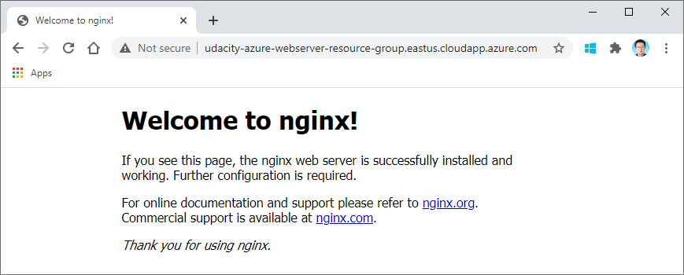

# Azure Infrastructure Operations Project: Deploying a scalable IaaS web server in Azure

### Introduction
For this project, you will write a Packer template and a Terraform template to deploy a customizable, scalable web server in Azure.

### Getting Started
1. Clone this repository

2. Create your infrastructure as code

3. Update this README to reflect how someone would use your code.

### Dependencies
1. Create an [Azure Account](https://portal.azure.com)

2. Install the [Azure command line interface](https://docs.microsoft.com/en-us/cli/azure/install-azure-cli?view=azure-cli-latest)

3. Install [Packer](https://www.packer.io/downloads)

4. Install [Terraform](https://www.terraform.io/downloads.html)

### Instructions
1. Deploy an Azure policy that ensures all indexed resources are tagged
    - Create the Azure policy definition by running the shell script [create_az_policy_definition.sh](create_az_policy_definition.sh)
    - Create the Azure policy assignment by running the shell script [create_az_policy_assignment.sh](create_az_policy_assignment.sh)
    - Verify policy effectiveness by creating index resources

2. Create a Packer image deployable by Terraform
    - Create an image resource group named `packer-rg` by: `az group create --location eastus --name packer-rg`
    - Create a Service Principal for Terraform named `TerraformSP` by: `az ad sp create-for-rbac --role="Contributor" --name="TerraformSP"`, and such command outputs 5 values: `appId`, `displayName`, `name`, `password`, and `tenant`.
    - Export environment variables `ARM_CLIENT_ID` and `ARM_CLIENT_SECRET` that correspond to the above `appId` and `password`, respectively, as well as `ARM_SUBSCRIPTION_ID` which is the Azure Subscription ID.
    - Complete the Packer template file [server.json](server.json)
    - Create the image by: `packer build server.json` (if any user variables remain to be assigned, place `-var 'key=value'` between `packer build` and `server.json`)

3. Deploy Azure resources with Terraform
    - Complete terraform configuration files
    - Plan the Terraform deployment: `terraform plan -var-file terraform.tfvars -out tfplan.out` ([terraform.tfvars](terraform.tfvars) defines all Terraform user variables and `-var-file terraform.tfvar` can actually be omitted if variables are defined in a file with exact name of [terraform.tfvars](terraform.tfvars))
    - Apply the Terraform deployment: `terraform apply "tfplan.out"`

4. Destroy all Azure resources
    - Destroy resources built by Terraform: `terraform destroy`
    - Destroy image built by Packer: `az image delete -g packer-rg -n my-packer-image`

### Output
1. Terraform output

2. Open the [deployed website](http://udacity-azure-webserver-resource-group.eastus.cloudapp.azure.com) in the browser

